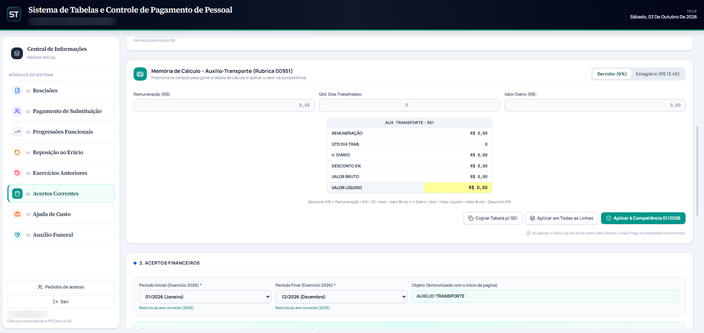

# 📊 Sistema de Tabelas

Sistema web que substitui planilhas de cálculos financeiros de pagamento de pessoal, gerando demonstrativos em PDF prontos para os processos.

> 🔒 Vitrine de um sistema em uso real. O código é privado, e todos os prints usam dados fictícios.

## ✨ Principais recursos

<table>
<tr>
<td width="55%">
<ul>
<li><b>Cálculos automáticos</b> de rescisões, substituições, progressões e outros acertos</li>
<li><b>PDF no formato oficial</b>, pronto para anexar aos processos</li>
<li><b>Leitura de PDFs</b> da folha, sem digitação</li>
<li><b>Cronograma da folha</b> com contagem regressiva</li>
<li><b>Login com Google</b> e acesso por aprovação</li>
<li><b>Nenhum dado sensível salvo</b>: tudo é calculado na hora</li>
</ul>
</td>
<td width="45%"></td>
</tr>
</table>

## 🛠️ Tecnologias

React · TypeScript · Vite · Supabase · Vercel (deploy automático)

## 🖼️ Telas

<table>
<tr>
<td width="50%"> <b>Rescisões:</b> escolha do tipo e dados do servidor</td>
<td width="50%"> <b>Memorial:</b> base legal e resumo do cálculo</td>
</tr>
<tr>
<td> <b>Substituição:</b> dias apurados e valor devido</td>
<td> <b>PDF:</b> demonstrativo pronto para baixar</td>
</tr>
<tr>
<td> <b>Progressões:</b> leitura automática de PDFs</td>
<td> <b>Auxílio-transporte:</b> memória de cálculo</td>
</tr>
</table>

---

🚧 Em uso e em evolução contínua · Desenvolvido por [Rafaela Silva](https://github.com/RafaelaSilva90) 💜
