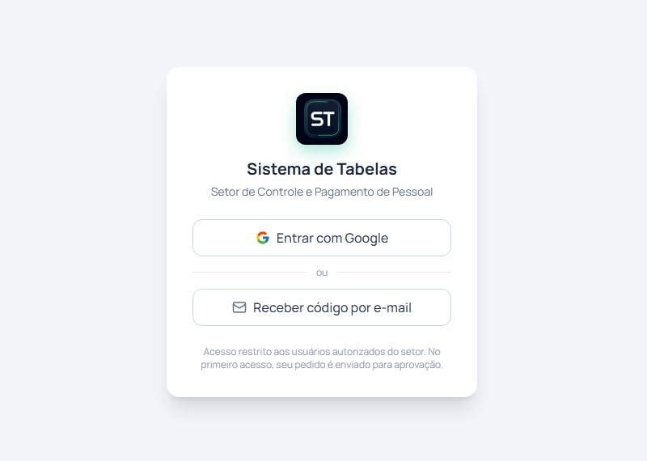
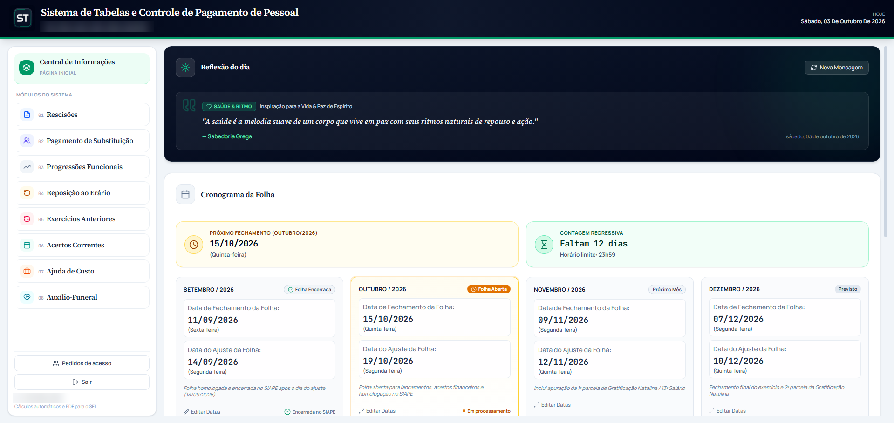
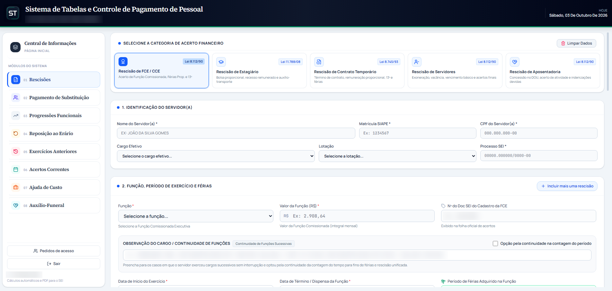
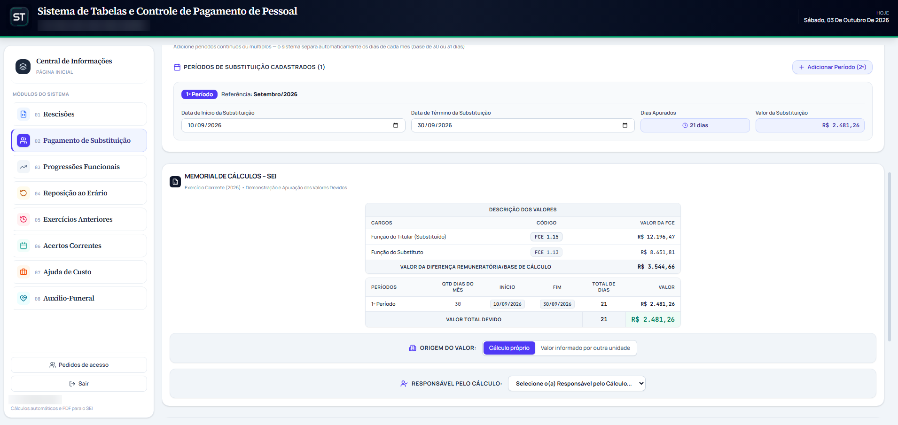
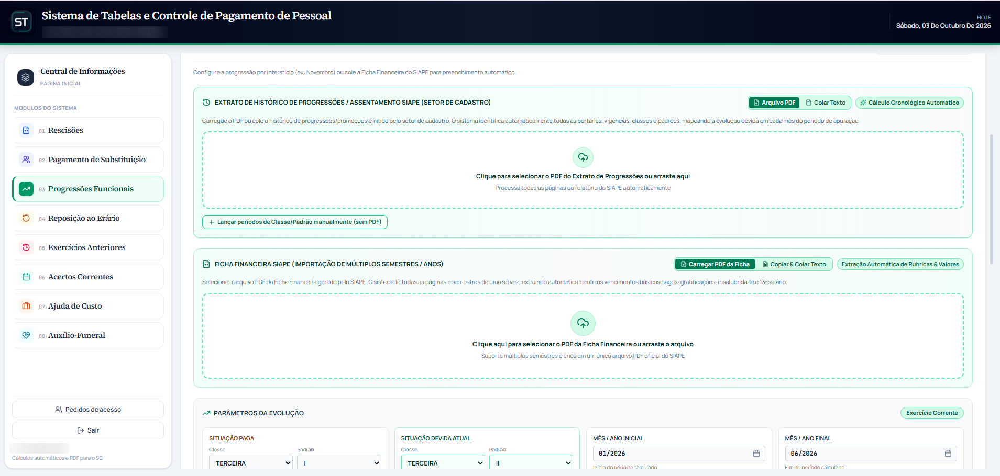
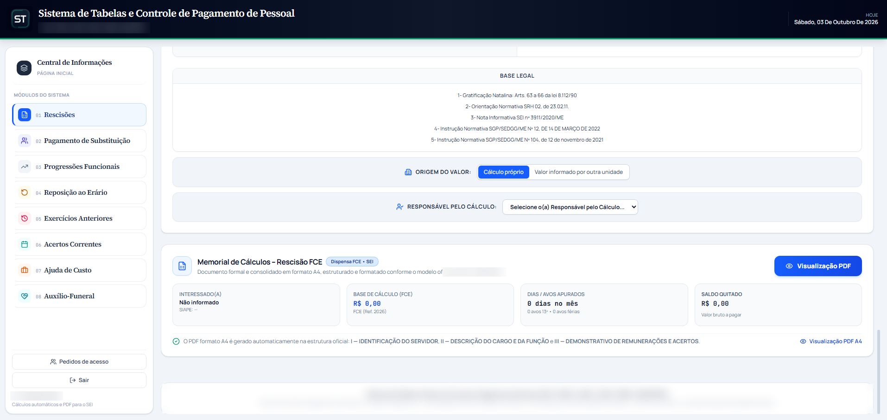
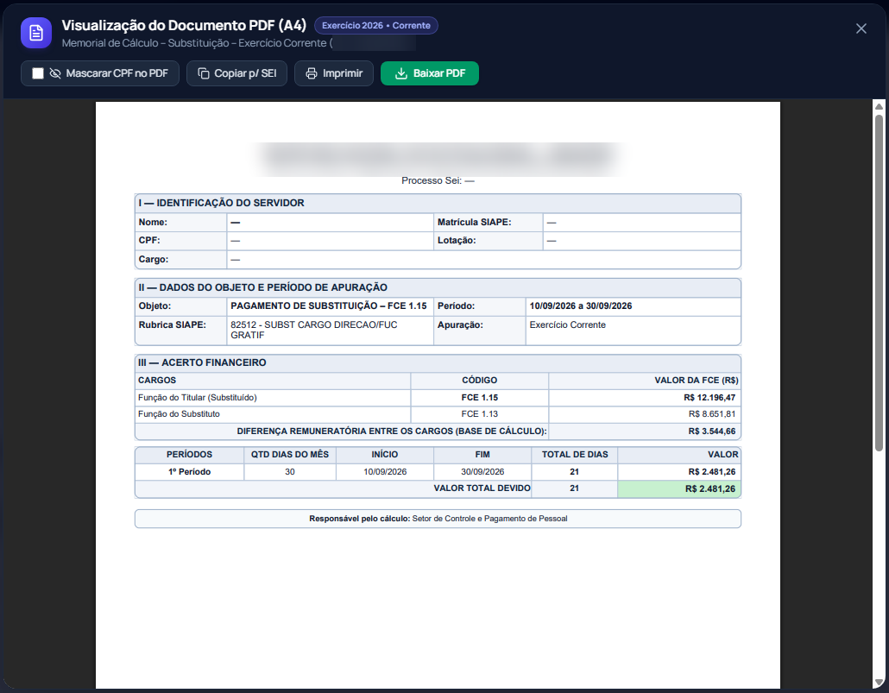

# 📊 Sistema de Tabelas

Sistema web que substitui planilhas de cálculos financeiros de pagamento de pessoal, gerando demonstrativos em PDF prontos para os processos.

> 🔒 Vitrine de um sistema em uso real. O código é privado, e todos os prints usam dados fictícios.

## ✨ Principais recursos

- **Acesso controlado:** entrada pelo Google ou por código enviado ao e-mail, só para usuários autorizados
- **Cálculos automáticos** de rescisões, substituições, progressões e outros acertos
- **Visualização do PDF antes de baixar**, no formato oficial
- **Leitura de PDFs** da folha, preenchendo os dados sem digitação
- **Cronograma da folha** com contagem regressiva
- **Nenhum dado sensível salvo:** tudo é calculado na hora

## 🛠️ Tecnologias

React · TypeScript · Vite · Supabase · Vercel (deploy automático)

## 🖼️ Telas

<table>
<tr>
<td width="50%"> <b>1. Acesso controlado:</b> entrada pelo Google ou por código no e-mail, apenas para usuários autorizados</td>
<td width="50%"> <b>2. Tela inicial:</b> reúne as funcionalidades que antes ficavam espalhadas em planilhas</td>
</tr>
<tr>
<td> <b>3. Rescisões:</b> preenchimento organizado em etapas</td>
<td> <b>4. Memorial de cálculo:</b> gerado automaticamente a partir dos dados informados</td>
</tr>
<tr>
<td colspan="2" align="center"> <b>7. Leitura de PDFs:</b> carregamento de extratos e fichas para preenchimento automático</td>
</tr>
<tr>
<td> <b>5. Visualização do PDF:</b> após o preenchimento, cada módulo permite conferir o documento antes de baixar</td>
<td> <b>6. Pré-visualização:</b> demonstrativo pronto para baixar ou imprimir</td>
</tr>
<tr>
<td colspan="2" align="center"> <b>7. Leitura de PDFs:</b> carregamento de extratos e fichas para preenchimento automático</td>
</tr>
</table>

---

🚧 Em uso e em evolução contínua · Desenvolvido por [Rafaela Silva](https://github.com/RafaelaSilva90) 💜
